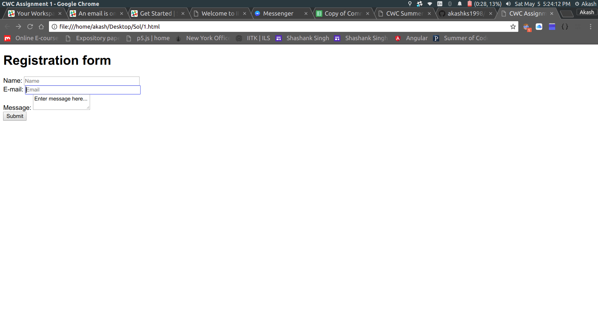
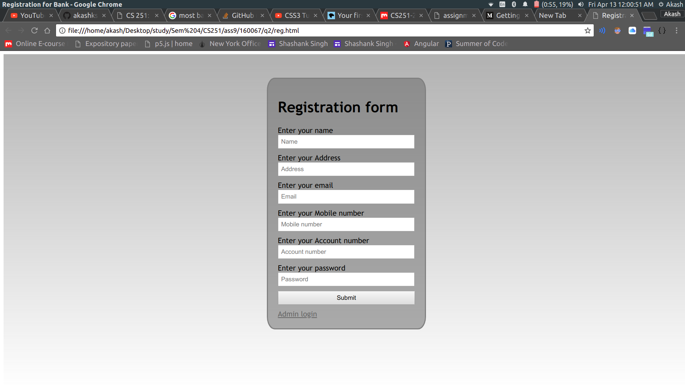
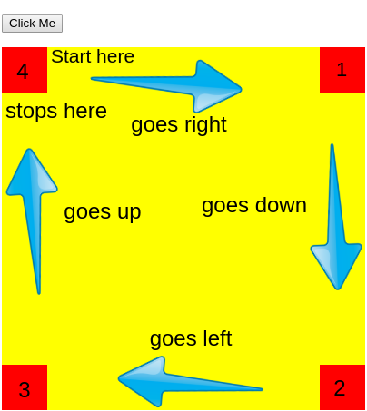

# Training
This repository is for CWC volunteers to learn basic HTML, CSS, JS and Git/GitHub.
## Task 1
Deadline- 5th May 
Request for homepage. 
Details are provided [here](http://www.iitk.ac.in/cc/homepage/)
## Assignment 1
## Its time for basic HTML
Deadline- 7th May 
[This is a basic tutorial for HTML](https://www.youtube.com/watch?v=Ggh_y-33Eso) 
[Other useful material](https://www.w3schools.com/html/) 
 
You have to create a page which looks similar to the one provided above. And follow the below constraints. 
name : Maximum 20 characters with only english alphabets and space 
email should be of the form “someone@xyz.com” where leftside may contain
english alphabets only and rightside must end with a “.com” domain name 
Message must be a textarea.
## Assignment 2
## Its time for basic CSS
Deadline- 10th May 
[This is basic tutorial for CSS](https://www.youtube.com/watch?v=CUxH_rWSI1k) 
Other useful material: W3 schools 
 
You have to create a page which looks similar to the one provided above. And follow the below constraints. 
a. name : Maximum 20 characters with only english alphabets and space 
b. address: Maximum 100 characters 
c. email should be of the form “someone@xyz.com” where leftside may contain
english alphabets only and rightside must end with a “.com” domain name 
d. Mobile number is a 10-digit numeric value 
e. Bank account number is a 5-digit numeric value 
f. Bank password can be maximum 20 alphanumeric characters and should not
be displayed when entered in the textbox.
## Assignment 3
## Your homepage
Deadline- 13th May 
In this Assignment you need to create your homepage. You are allowed to use templates. 
These are some simple and easy to use templates.
* [CV template from W3schools](https://www.w3schools.com/w3css/tryit.asp?filename=tryw3css_templates_cv&stacked=h)
* [One more CV](https://blackrockdigital.github.io/startbootstrap-resume/) and can be downloaded [here](https://codeload.github.com/BlackrockDigital/startbootstrap-resume/zip/gh-pages)
## Assignment 4
## Time to learn Git
Deadline- 17th May 
[I loved this tutorial series](https://www.youtube.com/watch?v=BCQHnlnPusY&list=PLRqwX-V7Uu6ZF9C0YMKuns9sLDzK6zoiV) 
[Another lovely tool](https://try.github.io/levels/1/challenges/1) 
Create a Github account 
Pull this repository 
Put all the files of previous Assignments in a folder named "your_roll no" 
And create a pull request.
## Assignment 5
## Javascript is Love :heart:
#### Resource
[Javascript](https://developer.mozilla.org/en-US/docs/Learn/Getting_started_with_the_web/JavaScript_basics) 
### Part-1
I think this one will be hard for you so please start early 
Deadline- 2nd June
Implement [k-nearest neighbour in javascript.](https://en.wikipedia.org/wiki/K-nearest_neighbors_algorithm) 
There will be 2 forms: 
* Form-1
  In this form there will be 3 input fields:
  * First one is x
  * Second one is y
  * Third one is catagory.
  Catagory- Red or green
* Form-2
  This form will have 3 input fields:
  * First one is x
  * Second one is y
  * Third one is k 
### Part-2
Deadline- 31st May 
You have to make an animation as shown in given images.
- You have to make a big container and a smaller box inside that and a `button`.  
- Now your motive is to make a function that moves the inner block linearly such that it starts from upper-left corner(4th position), goes to positions 1,2,3,4 respectively and stops at 4th position.   
- Now execute the function when the button is pushed.  

  

 

You can see an example [here](https://www.w3schools.com/howto/howto_js_animate.asp) for reference. 

------------------------------------------
## Other materials
[Bootstrap](https://www.youtube.com/watch?v=gqOEoUR5RHg) 
Assignment for them will be released soon.
